# Student-Management-System

Welcome to my repository. The **Student Management System (SMS)** is developed for transforming manual offline workload into online automatic system. It contains all the main
features such as adding and managing students, books with efficiently maintaining their data.  This is a complete SMS with all the necessary functionalties. It also provides feature to **generate report** and **manage file**.

# Getting Started

These instructions will get you a copy of the project up and running on your local machine for development and testing purposes.

## Prerequisites

It is good to have basic knowledge of HTML, CSS, PHP and MySQL to understand this project.
>We will use XAMP server as it has cross-platform support and we won't be needed to worry about the operating system support.
Download and install suitable XAMP server from this link - https://www.apachefriends.org/download.html

## Setting up the environment

- Download and extract project source code on your local machine.
- Paste the source code in the htdocs folder. Default path will be here("C:\xampp\htdocs")
- Open XAMP Control Panel and start Apache & MySQL service
- Open your web browser and paste this link ("http://localhost/phpmyadmin/"). It should open database server page.
- Create new empty database named student-management-system. Select the student-management-system database and import the SQL file given with the source code.
- Review the config file from both of the includes folders. Change username and password accordingly.
- Open your web browser and paste this link ("http://localhost/foldername-in-htdocs-directory/").
- Open your web browser and paste this link ("http://localhost/foldername-in-htdocs-directory/").

# Student-Management-System---PHP-MySQL

Available Functions

  * Student Management;
  * Subject Management;
  * Class Room Management;
  * Exam Management;
  * Attendance Management;
  * Teacher Management;
  * Parents Management;
  * User Management;
  * School Notice Distribution;

Setup Instruction

01. Create new MySQL database 'schoolnew' and import provided schoolnew.sql file.
02. Put all files and folders in your host's public directory.

Login Credentials

* Teacher Login - Email: teacher@gmail.com Password:1234
* Student Login - Email: student@gmail.com Password:1234
* Parent Login - Email: parent@gmail.com Password:1234

# Screenshots

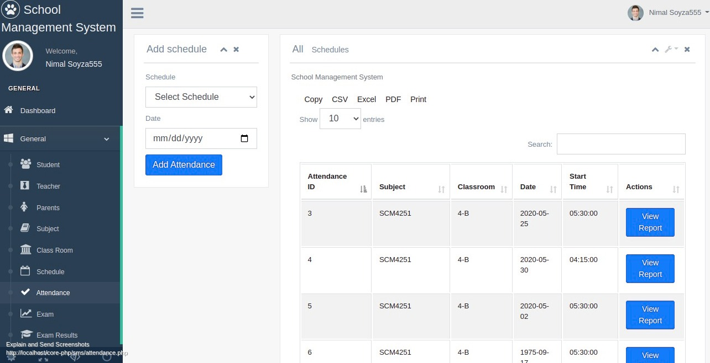

***

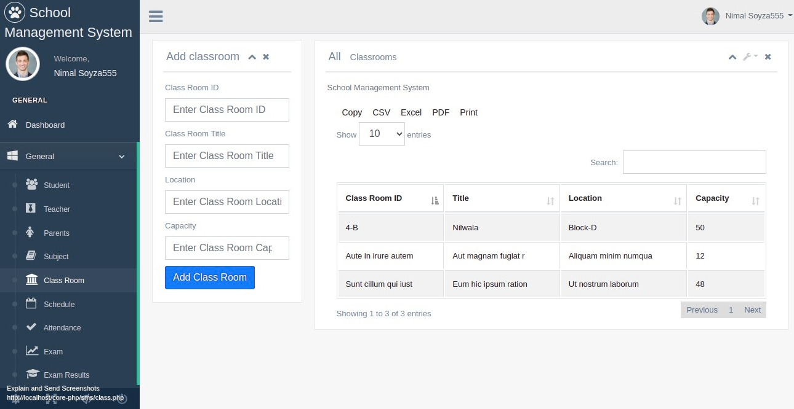

***

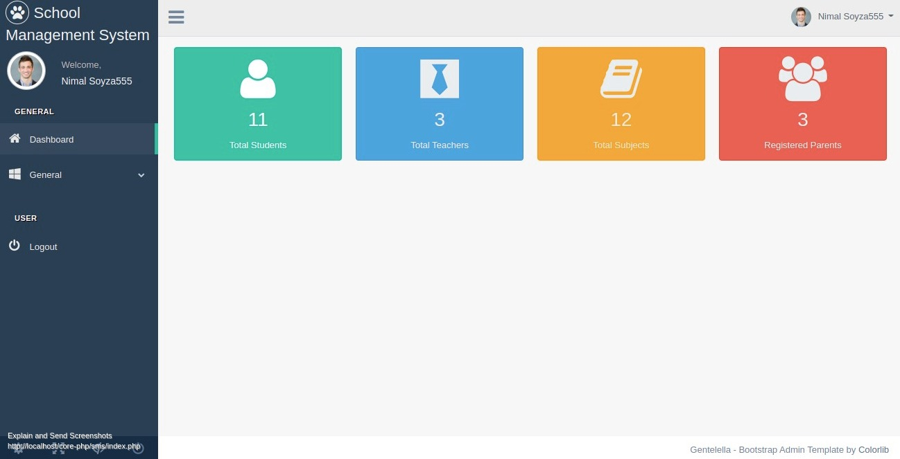

***

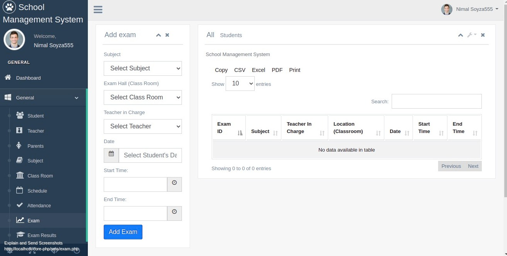

***

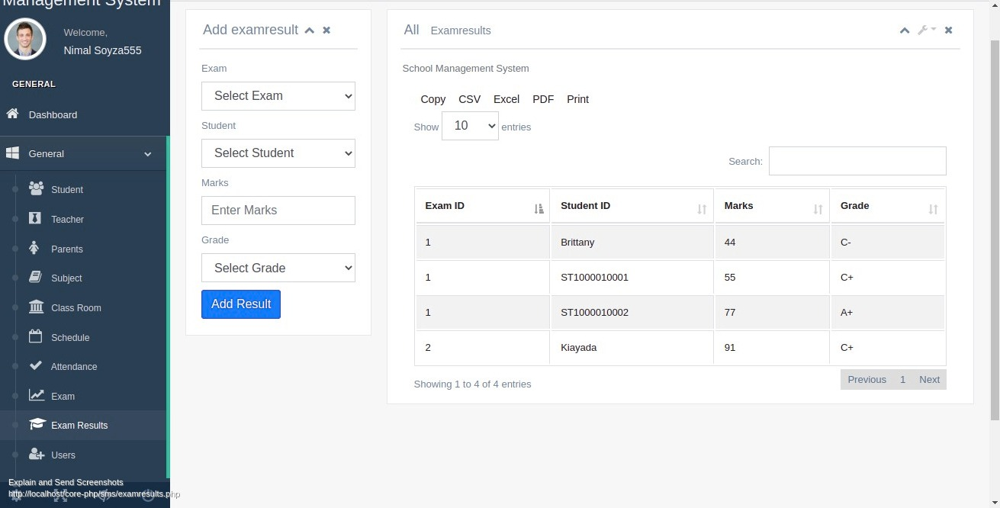

***

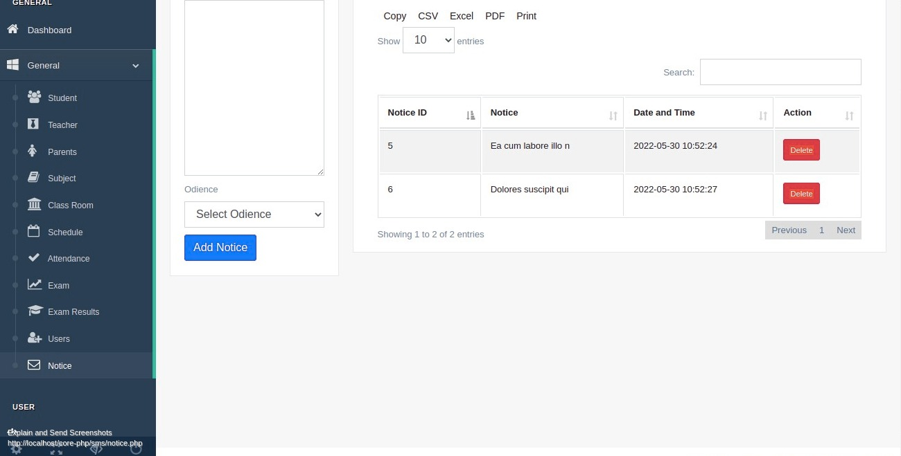

***

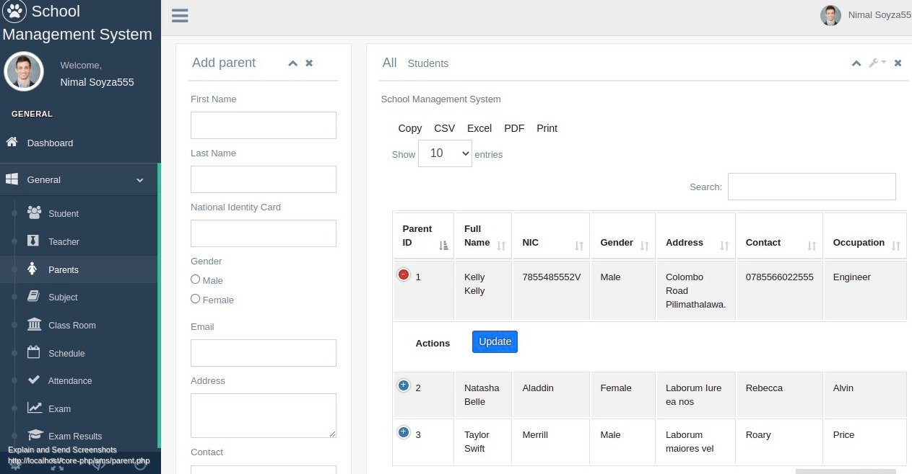

***

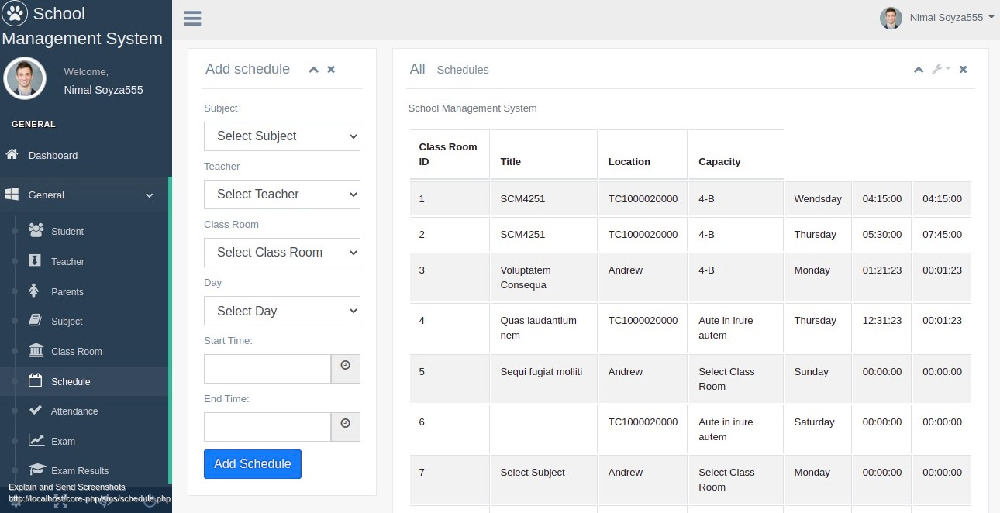

***

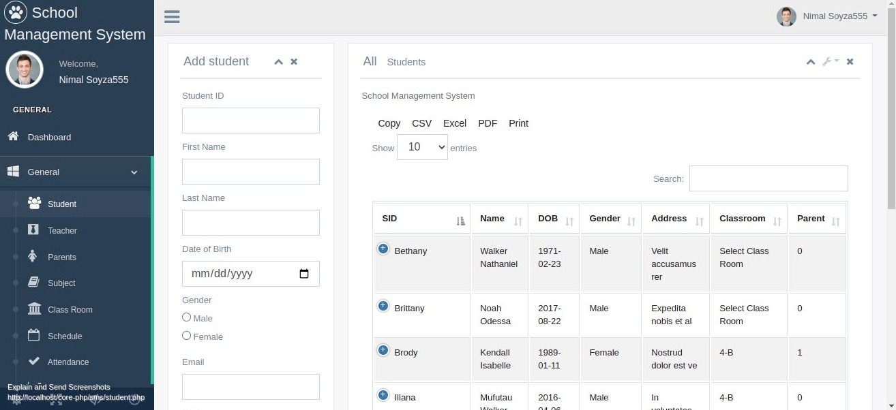

***

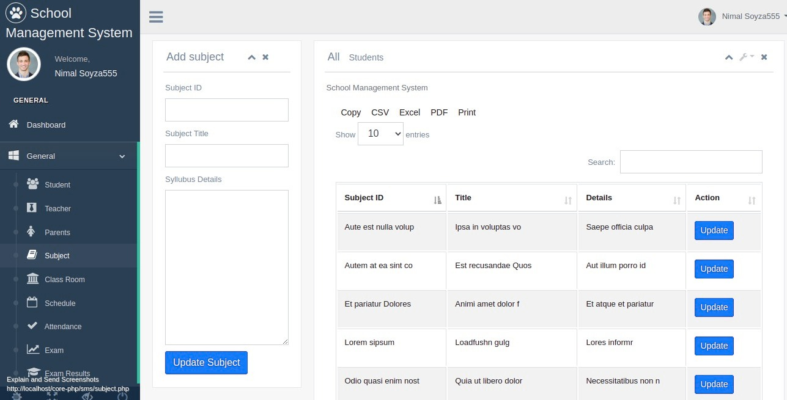

***

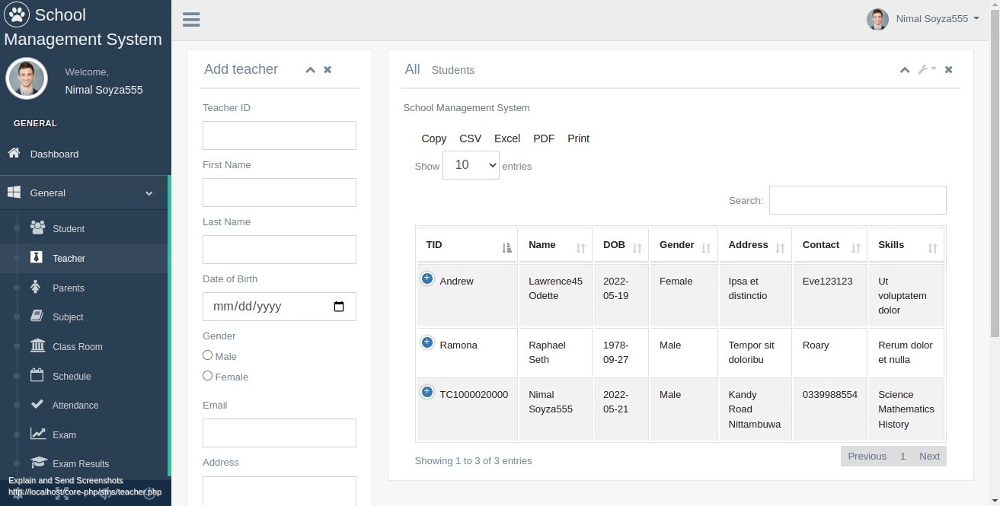

***

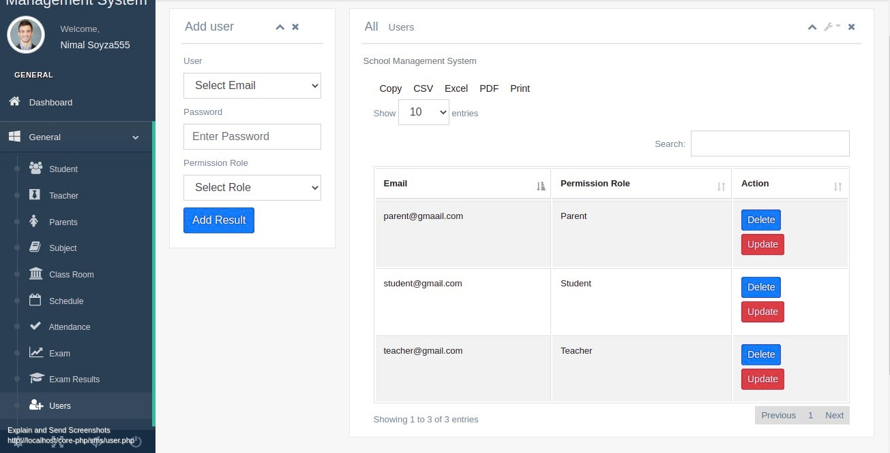
